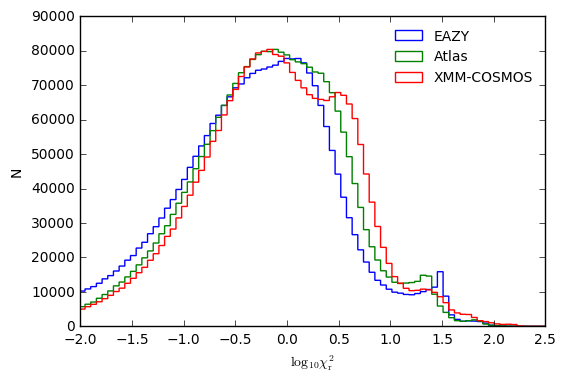
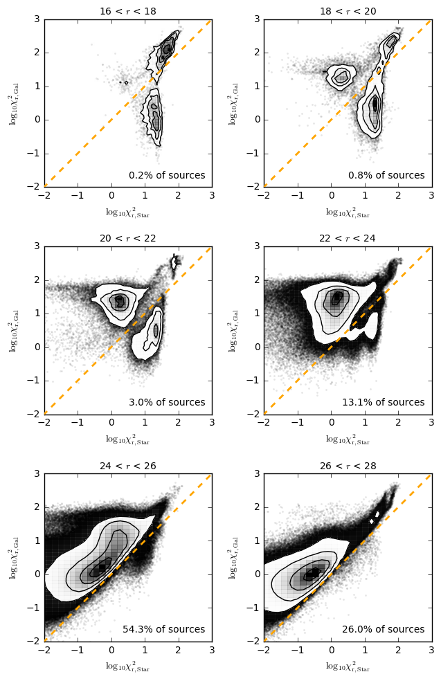
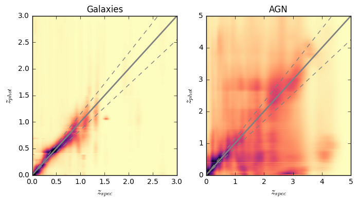
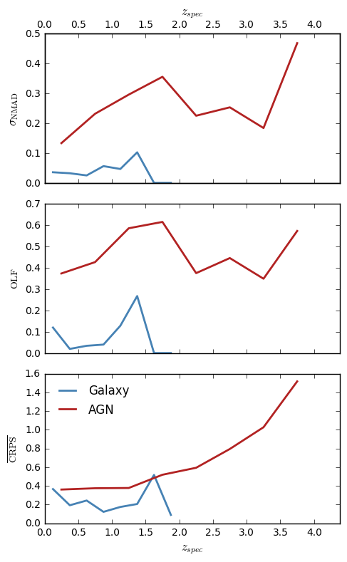
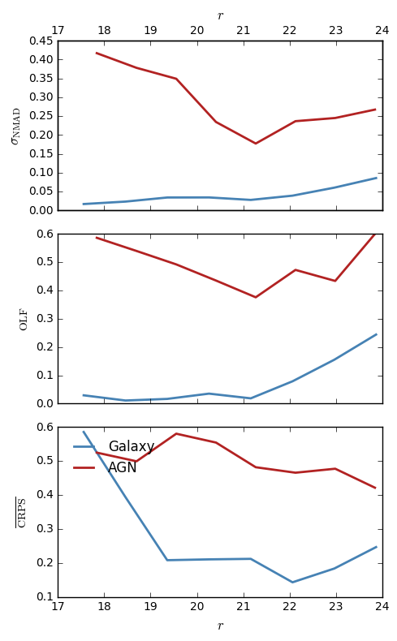
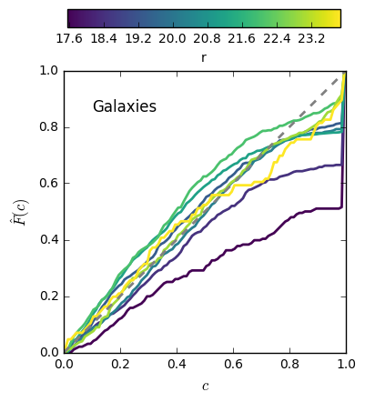
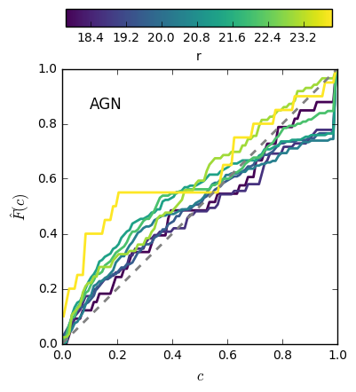

# ELAIS-N1 Photometric Redshifts - V1 (20170725)

master_catalogue_elais-n1_20170706_photoz_20170725_irac1_optimised.fits

## Key information

#### Masterlist used:
dmu1/dmu1_ml_ELAIS-N1/data/master_catalogue_elais-n1_20170706.fits

#### Spectroscopic redshift sample used:
dmu23/dmu23_ELAIS-N1/data/ELAIS-N1-specz-v2.1.fits

#### Templates used:

#### Filters used:

| Telescope / Instrument | Filter         | Available | Used |
|------------------------|----------------|-----------|------|
| Subaru/HSC             | suprime_g      | Yes    | Yes   |
| Subaru/HSC             | suprime_r      | Yes    | Yes   |
| Subaru/HSC             | suprime_i      | Yes    | Yes   |
| Subaru/HSC             | suprime_z      | Yes    | Yes   |
| Subaru/HSC             | suprime_y      | Yes    | Yes   |
| Subaru/HSC             | suprime_n921   | Yes    | Yes   |
| CFHT/MegaPrime/MegaCam | cfht_megacam_u | Yes    | Yes   |
| CFHT/MegaPrime/MegaCam | cfht_megacam_g | Yes    | Yes   |
| CFHT/MegaPrime/MegaCam | cfht_megacam_r | Yes    | Yes   |
| CFHT/MegaPrime/MegaCam | cfht_megacam_z | Yes    | Yes   |
| INT/WFC                | wfc_u          | Yes    | No    |
| INT/WFC                | wfc_g          | Yes    | No    |
| INT/WFC                | wfc_r          | Yes    | No    |
| INT/WFC                | wfc_i          | Yes    | No    |
| INT/WFC                | wfc_z          | Yes    | No    |
| Pan-STARRS1/Pan-STARRS1| gpc1_g         | Yes    | No    |
| Pan-STARRS1/Pan-STARRS1| gpc1_r         | Yes    | No    |
| Pan-STARRS1/Pan-STARRS1| gpc1_i         | Yes    | No    |
| Pan-STARRS1/Pan-STARRS1| gpc1_z         | Yes    | No    |
| Pan-STARRS1/Pan-STARRS1| gpc1_y         | Yes    | No    |
| UKIRT/WFCAM            | ukidss_j       | Yes    | Yes   |
| UKIRT/WFCAM            | ukidss_k       | Yes    | Yes   |
| Spitzer/IRAC           | irac_1         | Yes    | Yes   |
| Spitzer/IRAC           | irac_2         | Yes    | Yes   |
| Spitzer/IRAC           | irac_3         | Yes    | Yes   |
| Spitzer/IRAC           | irac_4         | Yes    | Yes   |

- INT/WFC and Pan-STARRS1 excluded from fitting due to systematic offsets
relative to the deeper Subaru/HSC and CFHT/MegaPrime optical datasets. Therefore sources outside of the footprint of the SparRCS/HSC footprint will have poor redshifts and should be excluded from current analysis.

#### Additional selections applied:
 - In order to have a fully calibrated redshift estimate, sources must have a
 magnitude detection Spitzer/IRAC Ch1. (Subaru/HSC or CFHT/MegaPrime r-band and UKIRT/WFCAM K-band optimisations will be included in V1.1)
 - Sources must also be detected in 5 different bands for a redshift to have been estimated.

#### Field-specific issues encountered:
When running the photometric redshift pipeline, I encountered a problem whereby the redshift pipeline was freezing approx. <1/3rd of the way into the process with no obvious cause for the error.

The cause of the problem was eventually identified as 3 specific galaxies for which eazy was not reaching convergence when fitting the eazy default template library - resulting in the whole pipeline freezing as the subsets including these sources could not complete. The sources were each only detected in the same 5 bands, with one of the measurements being excluded prior to fitting and therefore being fit with just 4 bands. However, there was no clear reason why this specific combination resulted in internal eazy errors compared to other filter combinations.

This problem has not been encountered before and is not easily fixed and/or predictable for future fields. In this case we increased the minimum filter requirement from 4 to 5, thus excluding the problem sources. This minimum filter requirement will be maintained for all future fields.

## Plots for diagnostics and quality checking

