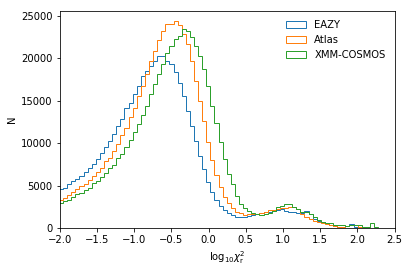
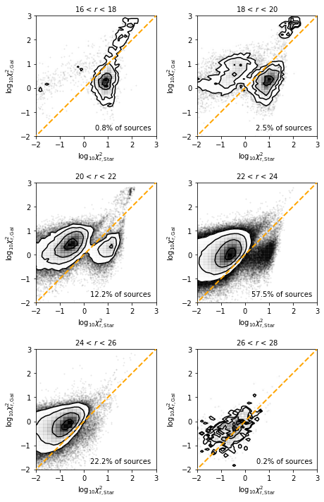
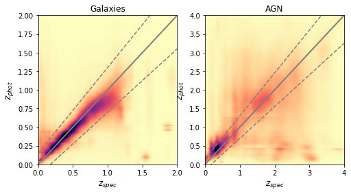
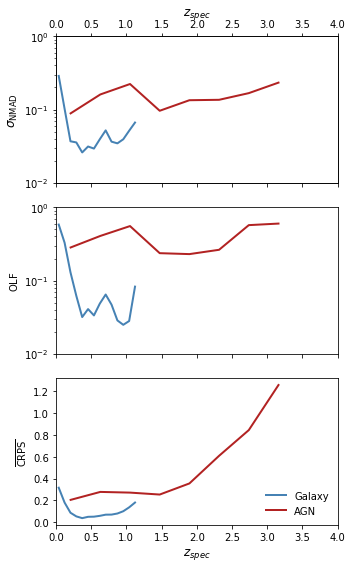
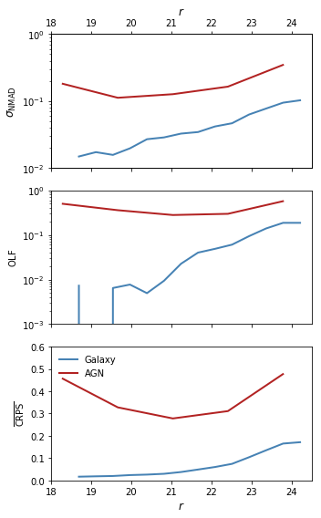
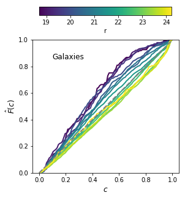
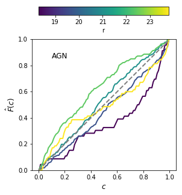

# ELAIS-S1 Photometric Redshifts - V1 (20180412)

ELAIS-S1/master_catalogue_ELAIS-S1_20171103_photoz_20180210.fits

## Key information

#### Masterlist used:
dmu1/dmu1_ml_ELAIS-S1/data/master_catalogue_ELAIS-S1_20171103.fits

#### Spectroscopic redshift sample used:
dmu23/dmu23_ELAIS-S1/data/ELAIS-S1-specz-v2.2.fits

#### Templates used:

- EAZY Default
- Atlas of Galaxy SEDs (Brown et al. 2014)
- XMM-COSMOS Template library

#### Filters used (Templates):

| Telescope / Instrument | Filter         | Available | Used |
|------------------------|----------------|-----------|------|
| CTIO/DECAM             | decam_g        | Yes    | Yes  |
| CTIO/DECAM             | decam_r        | Yes    | Yes  |
| CTIO/DECAM             | decam_i        | Yes    | Yes  |
| CTIO/DECAM             | decam_z        | Yes    | Yes  |
| CTIO/DECAM             | decam_y        | Yes    | Yes  |
| Pan-STARRS1/Pan-STARRS1| gpc1_g         | Yes    | No   |
| Pan-STARRS1/Pan-STARRS1| gpc1_r         | Yes    | No   |
| Pan-STARRS1/Pan-STARRS1| gpc1_i         | Yes    | No   |
| Pan-STARRS1/Pan-STARRS1| gpc1_z         | Yes    | No   |
| Pan-STARRS1/Pan-STARRS1| gpc1_y         | Yes    | No   |
| VISTA/VIRCAM           | vircam_z       | Yes    | Yes   |
| VISTA/VIRCAM           | vircam_y       | Yes    | Yes   |
| VISTA/VIRCAM           | vircam_j       | Yes    | Yes   |
| VISTA/VIRCAM           | vircam_h       | Yes    | Yes   |
| VISTA/VIRCAM           | vircam_k       | Yes    | Yes   |
| Spitzer/IRAC           | i1             | Yes    | Yes   |
| Spitzer/IRAC           | i2             | Yes    | Yes   |
| Spitzer/IRAC           | i3             | Yes    | Yes   |
| Spitzer/IRAC           | i4             | Yes    | Yes   |
| MPG/ESO 2.2-m / WFI    | wfi_b          | Yes    | Yes   |
| MPG/ESO 2.2-m / WFI    | wfi_b123       | Yes    | Yes   |
| MPG/ESO 2.2-m / WFI    | wfi_v          | Yes    | Yes   |
| MPG/ESO 2.2-m / WFI    | wfi_r          | Yes    | No    |

#### Additional Machine Learning Estimates

For the main galaxy population, three additional Gaussian Process machine learning estimates were also incorporated into the Bayesian combination estimates. These were training using the combined spectroscopic sample - with cost-sensitive learning weights calibrated for the full field.
The two sets of filters used were:
- DECAM g, r, i, z, y
- VISTA/VIRCAM Z, Y, J, H and Ks

#### Additional selections applied:
 - In order to have a fully calibrated redshift estimate, sources must have a magnitude measurement in any of the optical r-bands.
 - Sources must also be detected in 4 bands at different wavelengths for a redshift to have been estimated (i.e. multiple r-band detections count only as one), including 3 optical bands (b -> y). Multiple detections in similar optical bands are not counted.

#### Field-specific issues encountered:
As with previous fields we do not include PS1 in the fitting as there are deeper and better calibrated observations available from DECAM and VISTA. WFI r band was missed when processing the field. However the DECAM r band has identical depth while covering the full field, the redshifts will therefore not have suffered and so will not be re-run currently.
## Plots for diagnostics and quality checking

