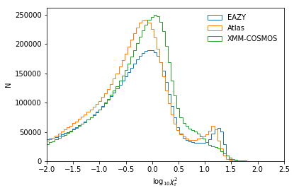
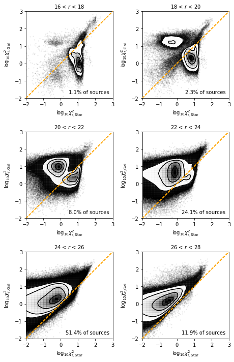
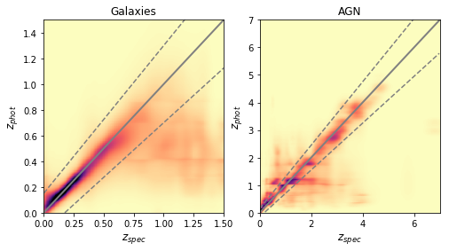
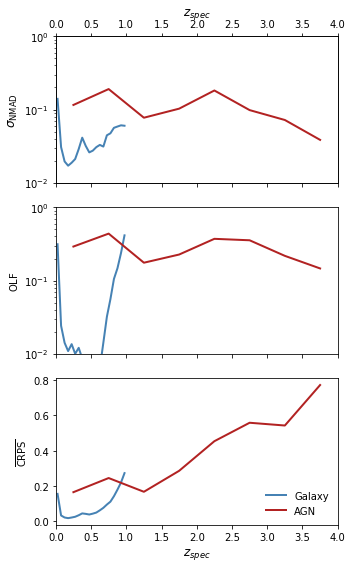
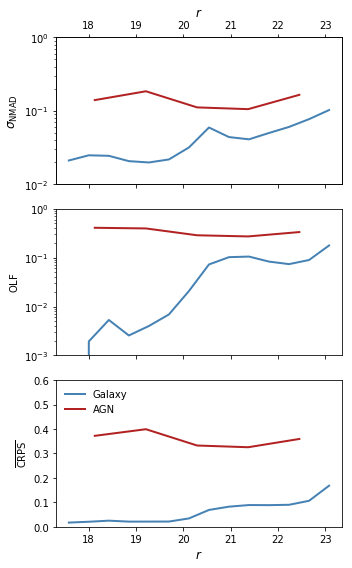
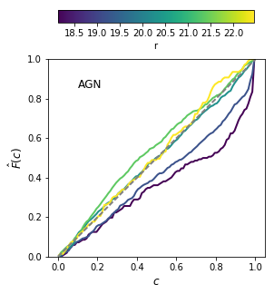

# GAMA 09 Photometric Redshifts - V1 (20180213)

GAMA15/master_catalogue_gama-15_20180119_photoz_20180210_r_optimised.fits

## Key information

#### Masterlist used:
dmu1/dmu1_ml_GAMA-09/data/master_catalogue_gama-09_20171206.fits

#### Spectroscopic redshift sample used:
dmu23/dmu23_GAMA-09/data/GAMA09-specz-v2_1-PRIVATE.csv   

#### Templates used:

- EAZY Default
- Atlas of Galaxy SEDs (Brown et al. 2014)
- XMM-COSMOS Template library

#### Filters used:

| Telescope / Instrument | Filter         | Available | Used |
|------------------------|----------------|-----------|------|
| Subaru/HSC             | suprime_g      | Yes    | Yes   |
| Subaru/HSC             | suprime_r      | Yes    | Yes   |
| Subaru/HSC             | suprime_i      | Yes    | Yes   |
| Subaru/HSC             | suprime_z      | Yes    | Yes   |
| Subaru/HSC             | suprime_y      | Yes    | Yes   |
| VST/OmegaCam           | omegacam_u     | Yes    | Yes   |
| VST/OmegaCam           | omegacam_g     | Yes    | Yes   |
| VST/OmegaCam           | omegacam_r     | Yes    | Yes   |
| VST/OmegaCam           | omegacam_i     | Yes    | Yes   |
| CFHT/MegaCAM           | megacam_u      | Yes    | Yes   |
| CFHT/MegaCAM           | megacam_g      | Yes    | Yes   |
| CFHT/MegaCAM           | megacam_r      | Yes    | Yes   |
| CFHT/MegaCAM           | megacam_z      | Yes    | Yes   |
| Pan-STARRS1/Pan-STARRS1| gpc1_g         | Yes    | No   |
| Pan-STARRS1/Pan-STARRS1| gpc1_r         | Yes    | No   |
| Pan-STARRS1/Pan-STARRS1| gpc1_i         | Yes    | No   |
| Pan-STARRS1/Pan-STARRS1| gpc1_z         | Yes    | No   |
| Pan-STARRS1/Pan-STARRS1| gpc1_y         | Yes    | No   |
| UKIRT/WFCAM            | ukidss_j       | Yes    | Yes   |
| UKIRT/WFCAM            | ukidss_h       | Yes    | Yes   |
| UKIRT/WFCAM            | ukidss_k       | Yes    | Yes   |
| VISTA/VIRCAM           | vircam_z       | Yes    | Yes   |
| VISTA/VIRCAM           | vircam_y       | Yes    | Yes   |
| VISTA/VIRCAM           | vircam_j       | Yes    | Yes   |
| VISTA/VIRCAM           | vircam_h       | Yes    | Yes   |
| VISTA/VIRCAM           | vircam_k       | Yes    | Yes   |

#### Additional Machine Learning Estimates

For the main galaxy population, three additional Gaussian Process machine learning estimates were also incorporated into the Bayesian combination estimates. These were training using the combined spectroscopic sample of all three GAMA fields - with cost-sensitive learning weights calibrated for each specific field.
The three sets of filters used were:
- OmegaCam u,g,r,i
- HyperSuprimeCam g,r,i,z,y
- OmegaCam g,r,i + VISTA/VIRCAM J and Ks

For the AGN subset, one GP estimate was also included resulting in much better performance. This estimate used the following filters:
- OmegaCam u,g,r,i + VISTA/VIRCAM J

#### Additional selections applied:
 - In order to have a fully calibrated redshift estimate, sources must have a magnitude measurement in either any of the optical r-bands.
 - Sources must also be detected in 4 bands at different wavelengths for a redshift to have been estimated (i.e. multiple r-band detections count only as one). Multiple detections in similar optical bands do not count due to the issues described below.

#### Field-specific issues encountered:
Initial runs including PanSTARRS and DECam observations resulted in significantly poorer results than expected given the excellent KIDS and HSC photometry available in the field. As these two datasets were found to be the main causes of the issues when used in combination with the other datasets, they were excluded resulting in excellent overall quality.
Due to the 

## Plots for diagnostics and quality checking

