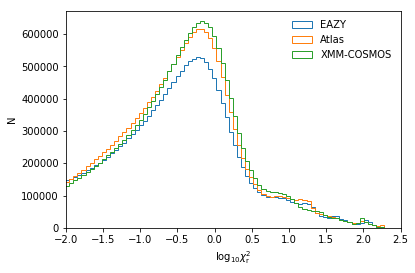
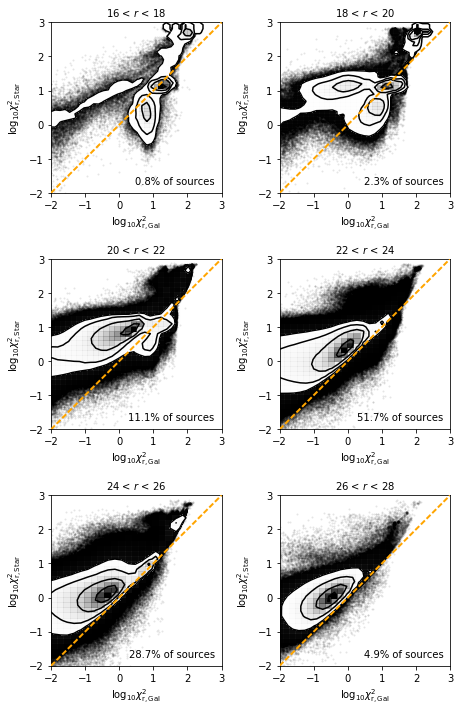
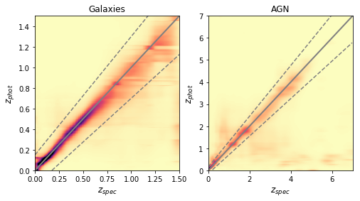
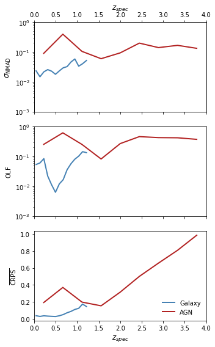
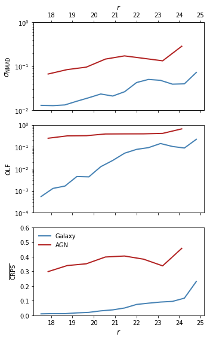
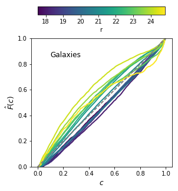
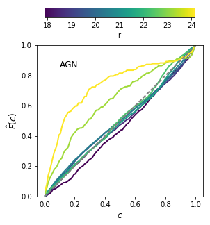

# Stripe-82 Photometric Redshifts - V1 (20180515)

Stripe-82/master_catalogue_herschel-stripe-82_20180307_photoz_20180509.fits

## Key information

#### Masterlist used:
dmu1/dmu1_ml_stripe-82/data/master_catalogue_herschel-stripe-82_20180307.fits

#### Spectroscopic redshift sample used:
dmu23/dmu23_stripe-82/data/HELP-SPECZ_Herschel-Stripe-82_20170202.fits

#### Templates used:

- EAZY Default
- Atlas of Galaxy SEDs (Brown et al. 2014)
- XMM-COSMOS Template library

#### Filters used:

| Telescope / Instrument | Filter         | Available | Used |
|------------------------|----------------|-----------|------|
| SDSS/SDSS           | sdss_u     | Yes    | Yes   |
| SDSS/SDSS           | sdss_g     | Yes    | Yes   |
| SDSS/SDSS           | sdss_r     | Yes    | Yes   |
| SDSS/SDSS           | sdss_i     | Yes    | Yes   |
| SDSS/SDSS           | sdss_z     | Yes    | Yes   |
| CTIO/DECAM             | decam_g        | Yes    | Yes   |
| CTIO/DECAM             | decam_r        | Yes    | Yes   |
| CTIO/DECAM             | decam_i        | Yes    | Yes   |
| CTIO/DECAM             | decam_z        | Yes    | Yes   |
| CTIO/DECAM             | decam_y        | Yes    | Yes   |
| CFHT/MegaCam           | megacam_g      | Yes    | No    |
| CFHT/MegaCam           | megacam_r      | Yes    | No    |
| CFHT/MegaCam           | megacam_i      | Yes    | No    |
| CFHT/MegaCam           | megacam_z      | Yes    | No    |
| CFHT/MegaCam           | megacam_y      | Yes    | No    |
| Subaru/HSC             | suprime_g      | Yes    | Yes   |
| Subaru/HSC             | suprime_r      | Yes    | Yes   |
| Subaru/HSC             | suprime_i      | Yes    | Yes   |
| Subaru/HSC             | suprime_z      | Yes    | Yes   |
| Subaru/HSC             | suprime_y      | Yes    | Yes   |
| Subaru/HSC             | suprime_n816      | Yes    | Yes   |
| Subaru/HSC             | suprime_n921      | Yes    | Yes   |
| Pan-STARRS1/Pan-STARRS1| gpc1_g         | Yes    | No   |
| Pan-STARRS1/Pan-STARRS1| gpc1_r         | Yes    | No   |
| Pan-STARRS1/Pan-STARRS1| gpc1_i         | Yes    | No   |
| Pan-STARRS1/Pan-STARRS1| gpc1_z         | Yes    | No   |
| Pan-STARRS1/Pan-STARRS1| gpc1_y         | Yes    | No   |
| VISTA/VIRCAM           | vista_z       | Yes    | Yes   |
| VISTA/VIRCAM           | vista_y       | Yes    | Yes   |
| VISTA/VIRCAM           | vista_j       | Yes    | Yes   |
| VISTA/VIRCAM           | vista_h       | Yes    | Yes   |
| VISTA/VIRCAM           | vista_k       | Yes    | Yes   |
| UKIRT/WFCAM           | ukidss_y       | Yes    | Yes   | 
| UKIRT/WFCAM           | ukidss_j       | Yes    | Yes   | 
| UKIRT/WFCAM           | ukidss_h       | Yes    | Yes   | 
| UKIRT/WFCAM           | ukidss_k       | Yes    | Yes   |
| CFHT/WIRCAM           | wircam_j       | Yes    | No    |
| CFHT/WIRCAM           | wircam_ks       | Yes    | No
| Spitzer/IRAC           | irac_i1        | Yes    | Yes   |
| Spitzer/IRAC           | irac_i2        | Yes    | Yes   |

#### Additional Machine Learning Estimates

For the main galaxy population, three additional Gaussian Process machine learning estimates were also incorporated into the Bayesian combination estimates. These were training using the combined spectroscopic sample in the field with cost-sensitive learning weights calibrated specifically for the full field.
The two sets of filters used were:
- SDSS ugriz
- DECAM g,r,i,z,y

Additionally, AGN specific GP estimates were trained and applied using the SDSS ugriz filter set.

#### Additional selections applied:
 - In order to have a fully calibrated redshift estimate, sources must have a magnitude measurement in any of the optical r-bands.
 - Sources must also be detected in 4 bands at different wavelengths for a redshift to have been estimated (i.e. multiple r-band detections count only as one). Multiple detections in similar optical bands do not count due to the issues described below.

## Plots for diagnostics and quality checking

