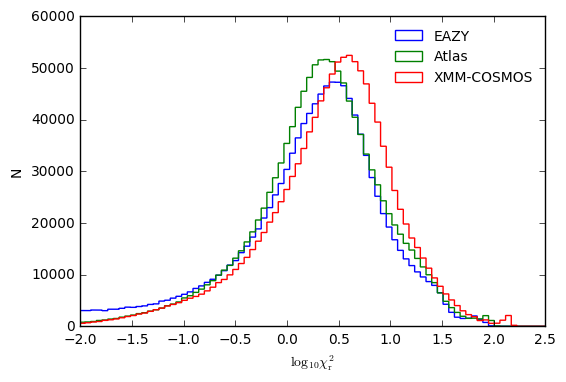
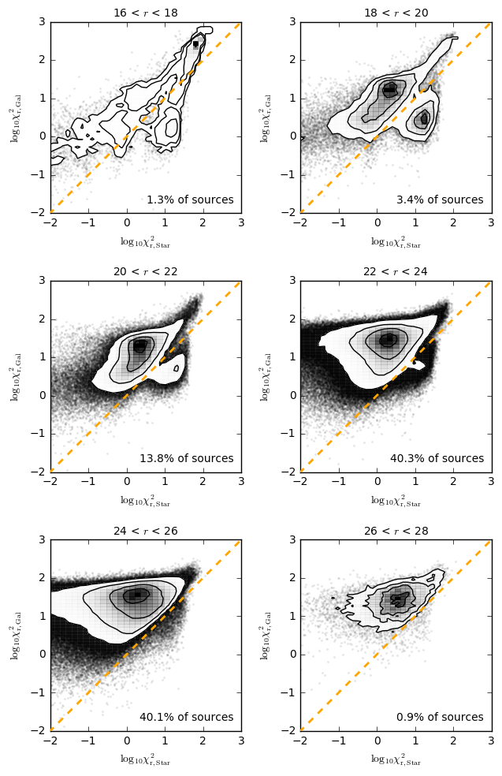
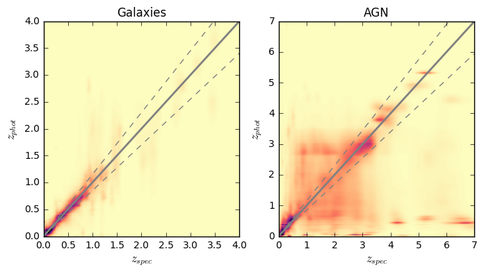
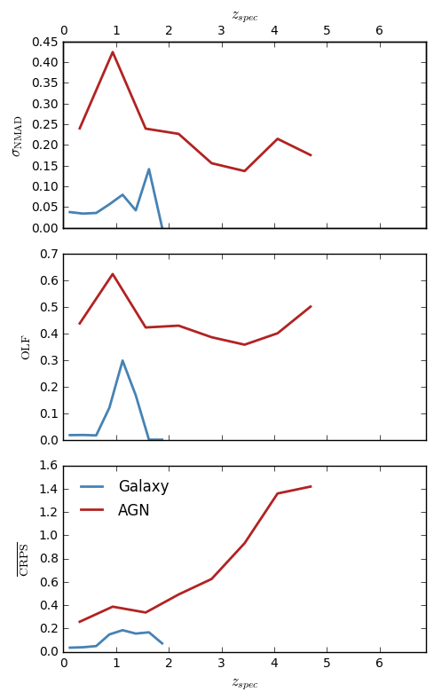
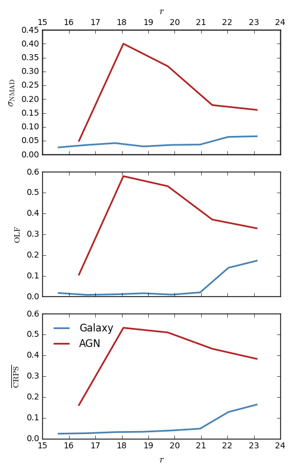
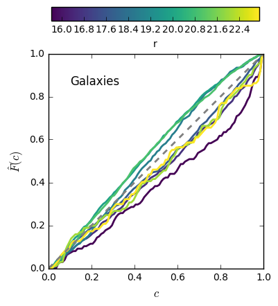
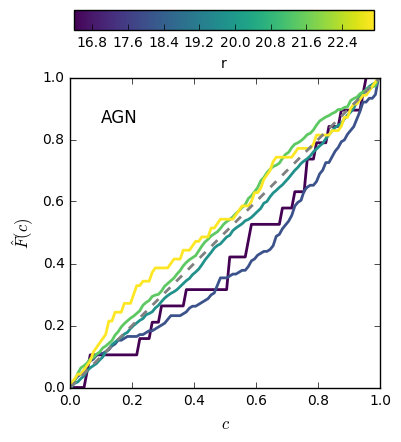

# Lockman-SWIRE Photometric Redshifts - V1 (20170802)

master_catalogue_Lockman-SWIRE_20170710_photoz_20170802_r_and_irac1_optimised.fits

## Key information

#### Masterlist used:
dmu1/dmu1_ml_Lockman-SWIRE/data/master_catalogue_Lockman-SWIRE_20170710.fits

#### Spectroscopic redshift sample used:
dmu23/dmu23_Lockman-SWIRE/data/Lockman-SWIRE-specz-v2.1.fits

#### Templates used:

#### Filters used:

| Telescope / Instrument | Filter         | Available | Used |
|------------------------|----------------|-----------|------|
| CFHT/MegaPrime/MegaCam* | cfht_megacam_u | Yes    | Yes   |
| CFHT/MegaPrime/MegaCam* | cfht_megacam_g | Yes    | Yes   |
| CFHT/MegaPrime/MegaCam* | cfht_megacam_r | Yes    | Yes   |
| CFHT/MegaPrime/MegaCam* | cfht_megacam_z | Yes    | Yes   |
| CFHT/MegaPrime/MegaCam** | cfht_megacam_g | Yes    | Yes   |
| CFHT/MegaPrime/MegaCam** | cfht_megacam_r | Yes    | Yes   |
| CFHT/MegaPrime/MegaCam** | cfht_megacam_i | Yes    | Yes   |
| CFHT/MegaPrime/MegaCam** | cfht_megacam_i_0 | Yes    | Yes   |
| CFHT/MegaPrime/MegaCam** | cfht_megacam_z | Yes    | Yes   |
| INT/WFC                | wfc_u          | Yes    | Yes   |
| INT/WFC                | wfc_g          | Yes    | Yes   |
| INT/WFC                | wfc_r          | Yes    | Yes   |
| INT/WFC                | wfc_i          | Yes    | Yes   |
| INT/WFC                | wfc_z          | Yes    | Yes   |
| Pan-STARRS1/Pan-STARRS1| gpc1_g         | Yes    | Yes   |
| Pan-STARRS1/Pan-STARRS1| gpc1_r         | Yes    | Yes   |
| Pan-STARRS1/Pan-STARRS1| gpc1_i         | Yes    | Yes   |
| Pan-STARRS1/Pan-STARRS1| gpc1_z         | Yes    | Yes   |
| Pan-STARRS1/Pan-STARRS1| gpc1_y         | Yes    | Yes   |
| UKIRT/WFCAM            | ukidss_j       | Yes    | Yes   |
| UKIRT/WFCAM            | ukidss_k       | Yes    | Yes   |
| Spitzer/IRAC           | irac_1         | Yes    | Yes   |
| Spitzer/IRAC           | irac_2         | Yes    | Yes   |
| Spitzer/IRAC           | irac_3         | Yes    | Yes   |
| Spitzer/IRAC           | irac_4         | Yes    | Yes   |

- * SpARCS, **RCSLenS - Where sources are detected in both SpARCS and RCSLenS catalogs for g, r or z, the deeper SpARCS catalog value is chosen. 
- Differing from EN1, INT/WFC and Pan-STARRS1 were included fitting despite the small systematic offsets to the deeper CFHT/MegaPrime optical datasets. Once the optical prior was folded in, photo-z performance remained excellent when all bands were included. 

#### Additional selections applied:
 - In order to have a fully calibrated redshift estimate, sources must have a
 magnitude detection in either any of the optical r-bands (CFHT, INT or PS1) or Spitzer/IRAC Ch1. For sources which are detected in both r and IRAC Ch1, the redshift and P(z) are taken from the r-band calibrated version.
 - Sources must also be detected in 5 bands at different wavelengths for a redshift to have been estimated (i.e. multiple r-band detections count only as one). Multiple detections in similar optical bands do not count due to the issues described below.

#### Field-specific issues encountered:
Issues with eazy not reaching convergence were also encountered for Lockman-SWIRE and with more frequency then were encountered for EN1. The larger sample of problematic objects made it easier to identify the source type where this problem actually occurs: objects for which there are detections in only 2-3 unique optical wavelengths, but with multiple detections in one or more of those bands.

Moving to the stricter criteria of requiring five detections in different wavelengths solved this problem, at the expense of about 300k masterlist sources no longer being fit (out of ~1.6million). However, given the fact these sources are typically very optically faint and do not have near/mid-IR detections, they would not be included in the subsequent physical modelling steps.

## Plots for diagnostics and quality checking

