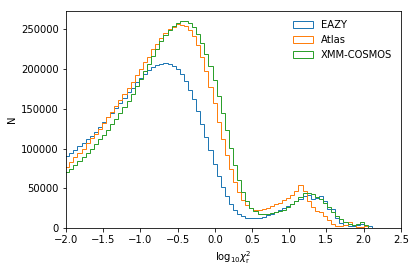
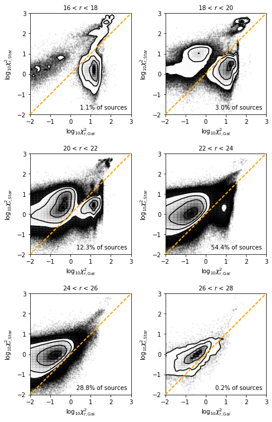
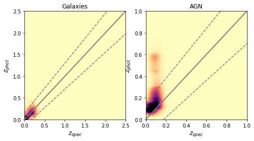
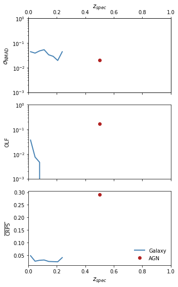
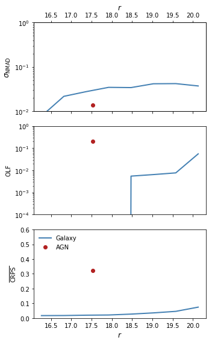
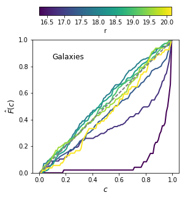
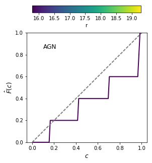

# SSDF Photometric Redshifts - V1 (20180612)

SSDF/master_catalogue_SSDF_20180221_photoz_20180612_r_optimised.fits

## Key information

#### Masterlist used:
dmu1/dmu1_ml_SSDF/data/master_catalogue_SSDF_20180221.fits

#### Spectroscopic redshift sample used:
dmu23/dmu23_SSDF/data/SSDF-specz-v2.fits

#### Templates used:

- EAZY Default
- Atlas of Galaxy SEDs (Brown et al. 2014)
- XMM-COSMOS Template library

#### Filters used:

| Telescope / Instrument | Filter         | Available | Used |
|------------------------|----------------|-----------|------|
| CTIO/DECAM             | decam_g        | Yes       | Yes   |
| CTIO/DECAM             | decam_r        | Yes       | Yes   |
| CTIO/DECAM             | decam_i        | Yes       | Yes   |
| CTIO/DECAM             | decam_z        | Yes       | Yes   |
| CTIO/DECAM             | decam_y        | Yes       | Yes   |
| VISTA/VIRCAM          | vista_j        | Yes    | Yes    |
| VISTA/VIRCAM          | vista_h        | Yes    | Yes    |
| VISTA/VIRCAM          | vista_ks        | Yes    | Yes    |
| Spitzer/IRAC          | irac_i1        | Yes    | Yes    |
| Spitzer/IRAC          | irac_i2        | Yes    | Yes    |

#### Additional selections applied:
 - In order to have a fully calibrated redshift estimate, sources must have a magnitude measurement in either any of the optical r-bands.
 - Sources must also have S/N > 2 in at least 4 bands at different wavelengths for a redshift to have been estimated (i.e. multiple r-band detections count only as one). Multiple detections in similar optical bands do not count due to the issues described below.

## Plots for diagnostics and quality checking

