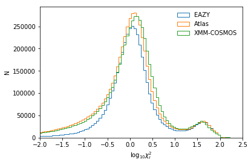
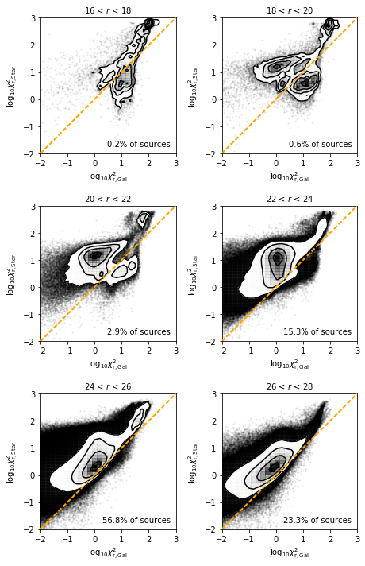
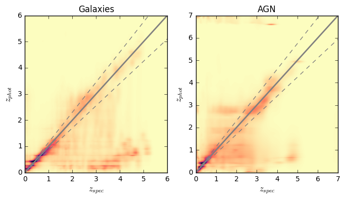
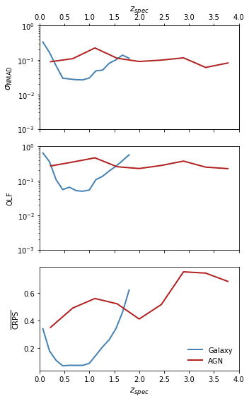
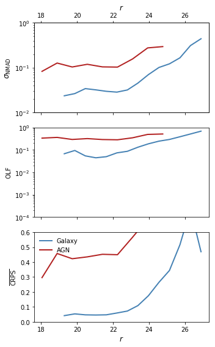
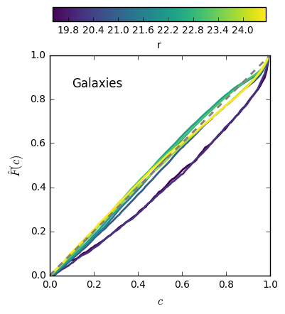

# XMM-LSS Photometric Redshifts - V1 (20180518)

XMM-LSS/master_catalogue_xmm-lss_20180221_photoz_2010518_r_optimised.fits

## Key information

#### Masterlist used:
dmu1/dmu1_ml_XMM-LSS/data/master_catalogue_XMM-LSS_20180221.fits

#### Spectroscopic redshift sample used:
dmu23/dmu23_XMM-LSS/data/XMM-LSS-specz-v2.8.fits

#### Templates used:

- EAZY Default
- Atlas of Galaxy SEDs (Brown et al. 2014)
- XMM-COSMOS Template library

#### Filters used:

| Telescope / Instrument | Filter         | Available | Used |
|------------------------|----------------|-----------|------|
| CTIO/DECAM             | decam_g        | Yes    | Yes   |
| CTIO/DECAM             | decam_r        | Yes    | Yes   |
| CTIO/DECAM             | decam_i        | Yes    | Yes   |
| CTIO/DECAM             | decam_z        | Yes    | Yes   |
| CTIO/DECAM             | decam_y        | Yes    | Yes   |
| CFHT/MegaCam           | megacam_u      | Yes    | Yes   |
| CFHT/MegaCam           | megacam_g      | Yes    | Yes   |
| CFHT/MegaCam           | megacam_r      | Yes    | Yes   |
| CFHT/MegaCam           | megacam_i      | Yes    | Yes   |
| CFHT/MegaCam           | megacam_y      | Yes    | Yes   |
| CFHT/MegaCam           | megacam_z      | Yes    | Yes   |
| Subaru/HSC             | suprime_g      | Yes    | Yes  |
| Subaru/HSC             | suprime_r      | Yes    | Yes  |
| Subaru/HSC             | suprime_i      | Yes    | Yes  |
| Subaru/HSC             | suprime_z      | Yes    | Yes  |
| Subaru/HSC             | suprime_y      | Yes    | Yes  |
| Subaru/HSC             | suprime_n816   | Yes    | Yes  |
| Subaru/HSC             | suprime_n921   | Yes    | Yes  |
| Subaru/SuprimeCam      | suprime_b      | Yes    | Yes  |
| Subaru/SuprimeCam      | suprime_v      | Yes    | Yes  |
| Subaru/SuprimeCam      | suprime_rc     | Yes    | Yes  |
| Subaru/SuprimeCam      | suprime_ip     | Yes    | Yes  |
| Subaru/SuprimeCam      | suprime_zp     | Yes    | Yes  |
| Pan-STARRS1/Pan-STARRS1| gpc1_g         | Yes    | No   |
| Pan-STARRS1/Pan-STARRS1| gpc1_r         | Yes    | No   |
| Pan-STARRS1/Pan-STARRS1| gpc1_i         | Yes    | No   |
| Pan-STARRS1/Pan-STARRS1| gpc1_z         | Yes    | No   |
| Pan-STARRS1/Pan-STARRS1| gpc1_y         | Yes    | No   |
| HST/ACS                | acs_f606w      | Yes    | Yes  |
| HST/ACS                | acs_f814w      | Yes    | Yes  |
| HST/WFC3               | wfc3_f125w     | Yes    | Yes  |
| HST/WFC3               | wfc3_f160w     | Yes    | Yes  |
| VISTA/VIRCAM           | vista_z       | Yes    | Yes   |
| VISTA/VIRCAM           | vista_y       | Yes    | Yes   |
| VISTA/VIRCAM           | vista_j       | Yes    | Yes   |
| VISTA/VIRCAM           | vista_h       | Yes    | Yes   |
| VISTA/VIRCAM           | vista_k       | Yes    | Yes   |
| UKIRT/WFCAM           | ukidss_y       | Yes    | Yes   | 
| UKIRT/WFCAM           | ukidss_j       | Yes    | Yes   | 
| UKIRT/WFCAM           | ukidss_h       | Yes    | Yes   | 
| UKIRT/WFCAM           | ukidss_k       | Yes    | Yes   |
| CFHT/WIRCAM           | wircam_j       | Yes    | Yes    |
| CFHT/WIRCAM           | wircam_h       | Yes    | Yes    |
| CFHT/WIRCAM           | wircam_ks       | Yes    | Yes   |
| Spitzer/IRAC           | irac_i1        | Yes    | Yes   |
| Spitzer/IRAC           | irac_i2        | Yes    | Yes   |
| Spitzer/IRAC           | irac_i3        | Yes    | Yes   |
| Spitzer/IRAC           | irac_i4        | Yes    | Yes   |

#### Additional Machine Learning Estimates

For the main galaxy population, three additional Gaussian Process machine learning estimates were also incorporated into the Bayesian combination estimates. These were training using the combined spectroscopic sample of XMM-LSS with cost-sensitive learning weights calibrated specifically for the XMM-LSS field.
The three sets of filters used were:
- CFHT/MegaCam u,g,r,z
- Subaru/HSC g,r,i,z,y
- Subaru/HSC g,r,i,z + VISTA/VIRCAM J and Ks

Additionally, an AGN classifier was trained using the following filters:
- Subaru/HSC g,r,i,z + VISTA/VIRCAM J and Ks + Spitzer/IRAC 3.6um

#### Additional selections applied:
 - In order to have a fully calibrated redshift estimate, sources must have a magnitude measurement in either any of the optical r-bands.
 - Sources must also have S/N > 2 in at least 4 bands at different wavelengths for a redshift to have been estimated (i.e. multiple r-band detections count only as one). Multiple detections in similar optical bands do not count due to the issues described below.

For a very small subset of sources, EAZY struggled to converge on fit. For the three subsets of 25k sources that this issue occurred in, the EAZY requirement of NMIN colours was raised to 6 when fitting the eazy template set. This change was not required for the Atlas/COSMOS libraries.

## Plots for diagnostics and quality checking

