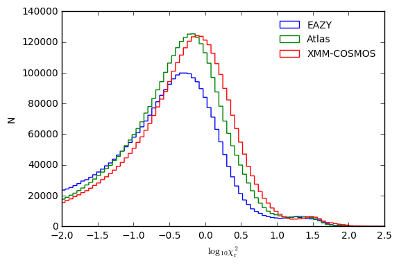
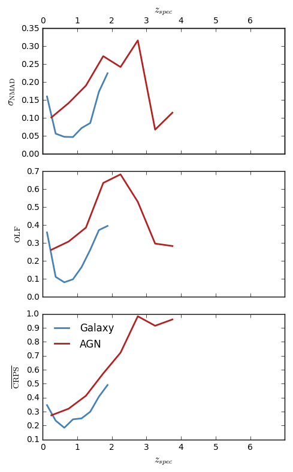
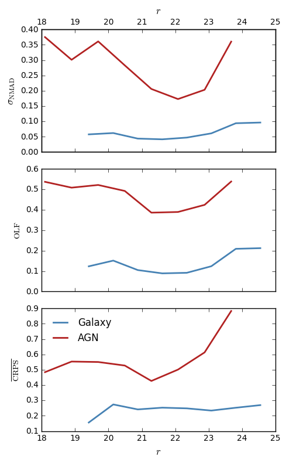
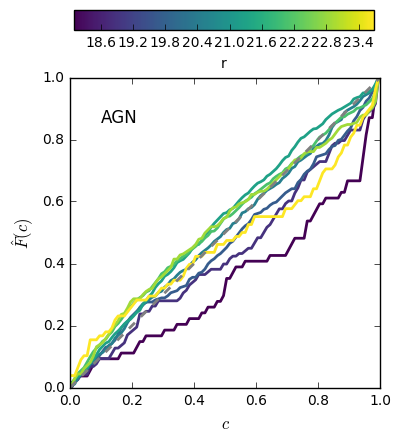

# XMM-LSS V0.1 (20170530)

master_catalogue_xmm-lss_20161124_photoz_20170530_cfht_r_optimised.fits

## Key information

#### Masterlist used:
dmu1/dmu1_ml_XMM-LSS/data/xmm-lss_catalogue_helplimited_helpid_20161124.fits.bz2

N.B. Old Masterlist based on Eduardo's code.

#### Spectroscopic redshift sample used:
dmu23/dmu23_XMM-LSS/data/XMM-LSS-specz-v2.5_helpid_20160512.fits 

#### Templates used:

#### Filters used:

| Telescope / Instrument | Filter         | Available | Used |
|------------------------|----------------|-----------|------|
| CFHT/MegaPrime/MegaCam | cfht_megacam_u | Yes    | Yes   |
| CFHT/MegaPrime/MegaCam | cfht_megacam_g | Yes    | Yes   |
| CFHT/MegaPrime/MegaCam | cfht_megacam_r | Yes    | Yes   |
| CFHT/MegaPrime/MegaCam | cfht_megacam_i | Yes    | Yes   |
| CFHT/MegaPrime/MegaCam | cfht_megacam_y | Yes    | Yes   |
| CFHT/MegaPrime/MegaCam | cfht_megacam_z | Yes    | Yes   |
| VISTA/VIRCAM           | VISTA.Z        | Yes    | Yes   |
| VISTA/VIRCAM           | VISTA.Y        | Yes    | Yes   |
| VISTA/VIRCAM           | VISTA.J        | Yes    | Yes   |
| VISTA/VIRCAM           | VISTA.H        | Yes    | Yes   |
| VISTA/VIRCAM           | VISTA.K        | Yes    | Yes   |
| UKIRT/WFCAM            | ukidss_j       | Yes    | Yes   |
| UKIRT/WFCAM            | ukidss_k       | Yes    | Yes   |
| Spitzer/IRAC           | irac_1         | Yes    | Yes   |
| Spitzer/IRAC           | irac_2         | Yes    | Yes   |
| Spitzer/IRAC           | irac_3         | Yes    | Yes   |
| Spitzer/IRAC           | irac_4         | Yes    | Yes   |

- CFHT Optical magnitudes chosen based on best available survey in order of CFHT Deep > CFHT Wide
- VISTA magnitudes chosen based on best available survey in order of VIDEO > VIKING > VHS
- Both SERVS and SWIRE observations included separately in the fitting.

#### Additional selections applied:
 - Before running through the photo-z pipeline, we required sources to have a detection in any of the g, r or i CFHT bands.
 - During the photo-z pipeline, r-band was chosen as the magnitude to use for the magnitude prior and for the redshift PDF calibration procedure. Therefore sources without an r-band detection will not have accurately calibrated redshift PDFs.

#### Field-specific issues encountered:
After correcting VIKING and VHS magnitudes to AB from Vega, a small average offset between VIKING/VHS magnitudes and corresponding VIDEO magnitudes is still present. In all the near-IR bands this was found to be ~0.15.

## Plots for diagnostics and quality checking

